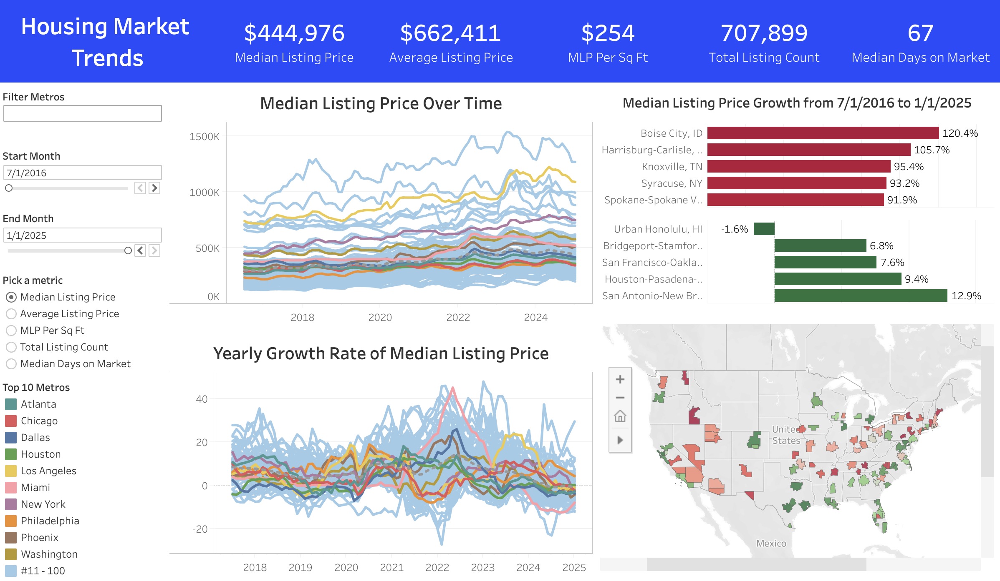
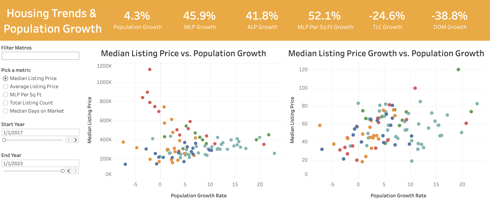
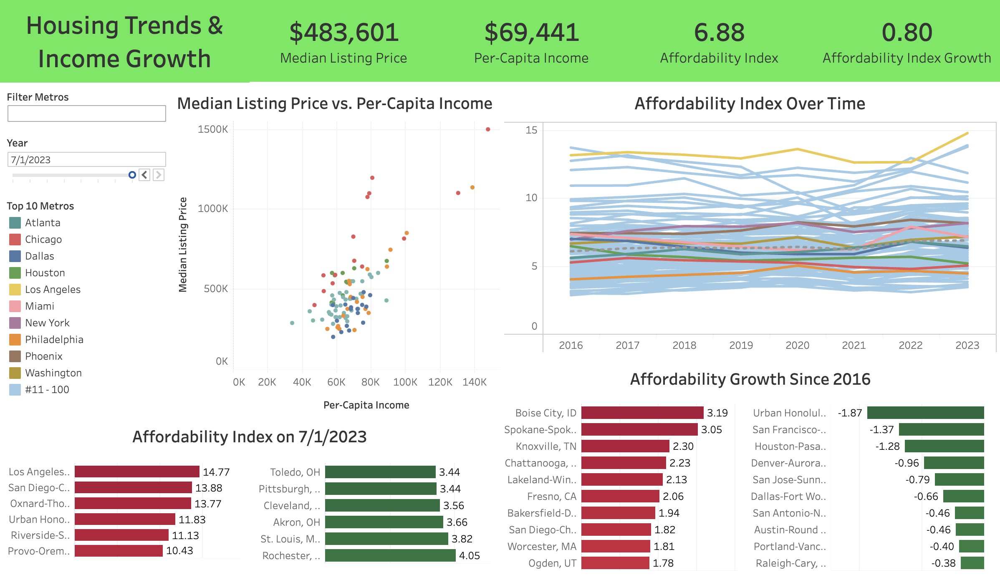
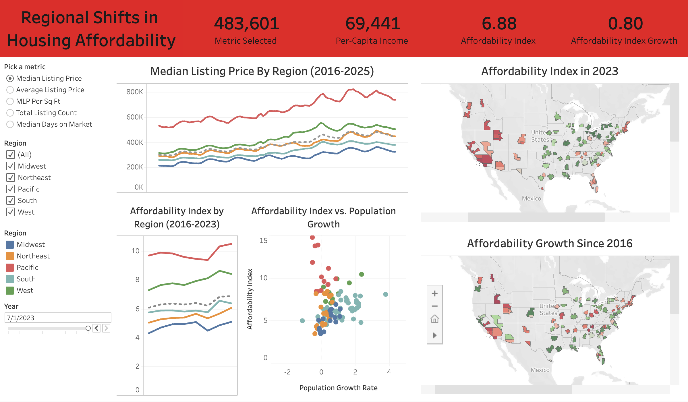

# Housing Affordability in U.S. Metro Areas

By Alexander Kasternakis

## Overview

This project explores housing data in the top 100 metro areas in the U.S. to analyze changes in housing affordability over time. Key metrics include housing market trends, population growth, and per-capita income. By examining these factors, we provide insights into how economic and demographic shifts have influenced the housing market.

## Objective

This analysis aims to answer the following questions:

1. How has the housing market changed in different metros over time?
2. How has population growth affected the housing market?
3. Are fluctuations in housing prices keeping up with rising income?
4. Which metro areas and regions have experienced the most significant shifts in affordability?

## Introducing the Data

#### Housing Market Data

The dataset used in this analysis is sourced from Realtor.com and spans from July 2016 to January 2025, with monthly updates. It includes key housing market indicators such as median and average listing prices, total listing counts, price per square foot, and medain days on market, all broken down by metro area. Click [here](https://www.realtor.com/research/data/) to view the data source.

#### Population Data

The population data used is from the U.S. Census and comtains annual estimates from 2016 to 2023, broken down by metro area. The data source is from census.gov and can be found [here](https://www.census.gov/data/tables/time-series/demo/popest/2010s-total-metro-and-micro-statistical-areas.html) for 2016-2019 data, and [here](https://www.census.gov/data/tables/time-series/demo/popest/2020s-total-metro-and-micro-statistical-areas.html) for 2020-2023 data.

#### Income Data

Income data used in this analysis is from the Federal Reserve Bank of St. Louis. the dataset includes per-capita income in the top 100 U.S. metros updated annualy from 2016 to 2023. Click [here](https://fred.stlouisfed.org/release?rid=175&t=msa&ob=pv&od=desc) to view the data source.

## Key Insights

SQL was used the setup and analyze the data. Click [here](https://github.com/XanderK555/Housing-Affordability-in-US-Metro-Areas/blob/main/table_setup.sql) to view the SQL code for setting up the tables, and click [here](https://github.com/XanderK555/Housing-Affordability-in-US-Metro-Areas/blob/main/analysis.sql) to view the queries used to analyze the data.

### Housing Market Trends

The dashboard highlights overall trends in U.S. housing prices from July 2016 to January 2025, showing a **significant increase in median and average listing prices across most metros since 2016**. The line charts reveal high volatility during the pandemic years (2020–2023), with sharp price spikes followed by recent stabilization. Price growth appears to be high in the **Mountain West**, parts of the **Northeast**, and **Tennessee**. Conversely, areas with lower price growth include the **Deep South**, **Florida**, **coastal California**, and **East Texas**.

This dashboard was made in Tableau, click [here](https://public.tableau.com/app/profile/xander.kasternakis/viz/HousingMarketTrends_17415530705220/HousingData#1) to view the full interactive dashboard.

- The average median listing price in the top 100 metros has increased by **48%**.
- **Boise, ID** saw the highest housing price growth among the top 100 metros, leading in **median listing price (+120%)** and **median price per square foot (+131%)**, while ranking 2nd in **average listing price growth (+134%)** since 2016. **Knoxville, TN, Syracuse, NY, and Spokane, WA** also experienced significant price growth, each ranking in the **top 5 for at least two of the three key housing price metrics**.
- **Honolulu, HI** is the only metro among the top 100 to experience a **decline in median listing price (-1.6%)**, along with the **lowest average listing price growth (+0%)**, and **median price per square foot growth (+17%)**. **San Francisco, CA**, **Bridgeport, CT**, and the **Texas Triangle metros** also saw relatively modest housing price growth.
- Generally, total listings grew the fastest in the **Southeast**, and the slowest in the **Northeast**, with the metros in the **West** seeing mixed trends.

### Housing Trends & Population Growth

The dashboard compares housing prices and the growth of housing prices to population growth from 2017 to 2023. While higher population growth generally leads to higher increases in home prices, this correlation is not strict. Some rapidly growing metropolitan areas have experienced modest growth in home prices.

This dashboard was made in Tableau, click [here](https://public.tableau.com/app/profile/xander.kasternakis/viz/HousingTrendsPopulationGrowth/HousingTrendsPopulationGrowth) to view the full interactive dashboard.

*Some metros, notably New Haven, CT and New Orleans, LA, appear to have steep declines in population between 2019 and 2020, due to discrepancies between yearly estimates and the 2020 census.*

- The metros with the highest house prices expierenced **population decline or very little growth**, with every metro having a median listing price greater than **$650,000** expierencing **less than 1% population growth** between 2017 and 2023.
- The metros of **Grand Rapids, MI**, **Seattle, WA**, **Portland, OR**, and **Buffalo, NY** have **total listings growing at least 10 times faster than population growth**, making them the areas where **housing supply is outpacing demand the most**.
- Overall, housing supply **decreased by 24%**, and most metros are expierencing **population growth** and **decreasing housing supply**, indicating a **tighter housing market**.

### Housing Trends & Income Growth

The dashboard compares **median listing price** and **per-capita income** from **2016 to 2023** using the **affordability index** (median listing price divided by per-capita income). A **lower affordability index** means a metro is more affordable, while a **higher affordability index** indicates a less affordable metro. The average affordability index of the top 100 U.S. metros is **6.88**, and since 2016, the average affordability index has **increased by 0.80**, indicating that, in general, **rising housing prices are gradually outpacing income growth**.

This dashboard was made in Tableau, click [here](https://public.tableau.com/app/profile/xander.kasternakis/viz/HousingTrendsIncomeGrowth/HousingTrendsvs_IncomeGrowth) to view the full interactive dashboard.

- **Toledo, OH**, and **Pittsburgh, PA** are the most affordable metros, with affordability indexes of **3.44**. Other metros in the **Midwest** round off the top 5 with affordability indexes below **4.0**.
- The least affordable metro is **Los Angeles, CA**, with an affordability index of **14.77**. Every metro in **Southern California** ranks in the **top 5 least affordable metros**, all with affordability indexes above **11.0**. The only non-California metro in the top 5 is **Honolulu, HI**, with an index of **11.83**.
- The affordability index of **Boise, ID** increased by **3.19**, the most in the U.S. with **Spokane, WA**, **Knoxville, TN**, and **Chattanooga, TN** becoming significantly less affordable as well. Conversely, **Honolulu, HI** has the greatest increase in affordability, with its affordability index **decreasing by 1.87**. The **San Francisco Bay Area** and the **Texas Triangle** also saw **significant decreases in their affordability indexes**.
- In general, there is a **strong correlation between the growth of housing prices and the change in affordability index**, implying that **housing prices are more volatile than per-capita income**.

### Regional Shifts in Housing Affordability

This dashboard was made in Tableau, click [here](https://public.tableau.com/app/profile/xander.kasternakis/viz/RegionalShiftsinHousingAffordability/Dashboard4) to view the full interactive dashboard.
